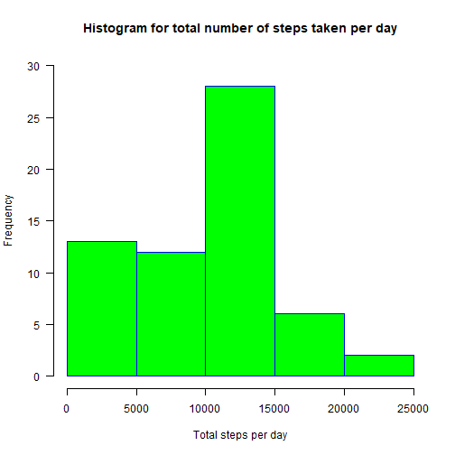
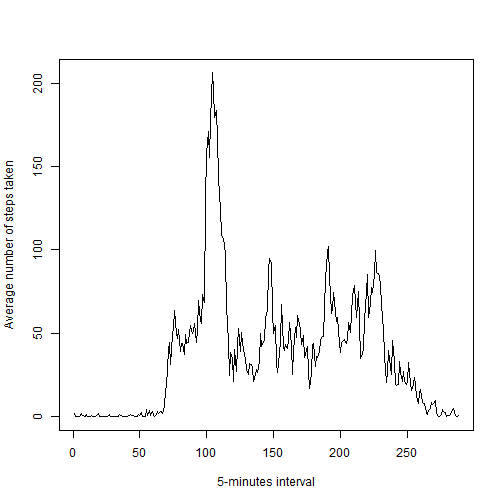
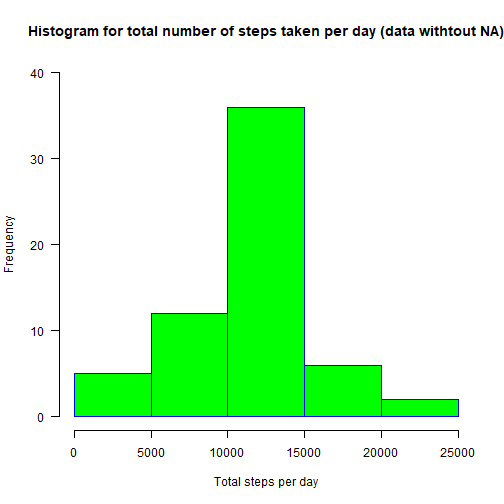
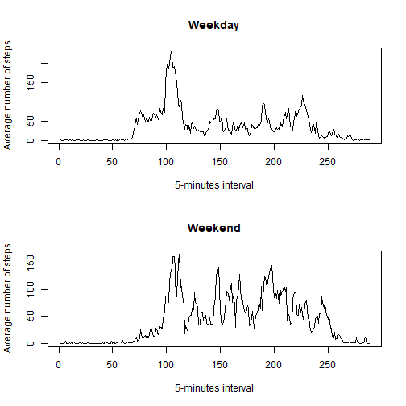

## Introduction

It is now possible to collect a large amount of data about personal movement using activity monitoring devices such as a Fitbit, Nike Fuelband, or Jawbone Up. These type of devices are part of the "quantified self" movement - a group of enthusiasts who take measurements about themselves regularly to improve their health, to find patterns in their behavior, or because they are tech geeks. But these data remain under-utilized both because the raw data are hard to obtain and there is a lack of statistical methods and software for processing and interpreting the data.

This assignment makes use of data from a personal activity monitoring device. This device collects data at 5 minute intervals through out the day. The data consists of two months of data from an anonymous individual collected during the months of October and November, 2012 and include the number of steps taken in 5 minute intervals each day.

The data for this assignment can be downloaded from the course web site: https://d396qusza40orc.cloudfront.net/repdata%2Fdata%2Factivity.zip

Dataset: Activity monitoring data [52K]
The variables included in this dataset are:

* steps: Number of steps taking in a 5-minute interval (missing values are coded as \color{red}{\verb|NA|}NA)
* date: The date on which the measurement was taken in YYYY-MM-DD format
* interval: Identifier for the 5-minute interval in which measurement was taken

The dataset is stored in a comma-separated-value (CSV) file and there are a total of 17,568 observations in this dataset.


## Loading and preprocessing the data

Data set must be in the same folder as this script. 


```r
rawdata <- read.csv("activity.csv")
```

## What is mean total number of steps taken per day?

1. Calculate the total number of steps taken per day


```r
total_steps_per_day <- tapply(rawdata$steps,as.factor(rawdata$date),sum,na.rm=TRUE)
```

2. Make a histogram of the total number of steps taken each day

```r
hist(total_steps_per_day,
main="Histogram for total number of steps taken per day", 
xlab="Total steps per day", 
border="blue", 
col="green",
ylim = c(0,30),
las=1, 
breaks=5)
```



3. Calculate and report the mean and median of the total number of steps taken per day


```r
mean(total_steps_per_day)
```

```
## [1] 9354.23
```

```r
median(total_steps_per_day)
```

```
## [1] 10395
```

## What is the average daily activity pattern?

1. Make a time series plot (i.e. \color{red}{\verb|type = "l"|}type="l") of the 5-minute interval (x-axis) and the average number of steps taken, averaged across all days (y-axis)


```r
mean_steps_per_interval <- tapply(rawdata$steps,as.factor(rawdata$interval),mean,na.rm=TRUE)
plot(mean_steps_per_interval, type = "l", ylab = "Average number of steps taken", xlab = "5-minutes interval")
```



2. Which 5-minute interval, on average across all the days in the dataset, contains the maximum number of steps?


```r
row.names(mean_steps_per_interval)[which.max(mean_steps_per_interval)]
```

```
## [1] "835"
```

## Imputing missing values
Note that there are a number of days/intervals where there are missing values (coded as \color{red}{\verb|NA|}NA). The presence of missing days may introduce bias into some calculations or summaries of the data.

1. Calculate and report the total number of missing values in the dataset (i.e. the total number of rows with \color{red}{\verb|NA|}NAs)


```r
sum(is.na(rawdata$steps))
```

```
## [1] 2304
```

2. Devise a strategy for filling in all of the missing values in the dataset

The strategy will be replacing the NA values with the avarage steps on that same time interval.

3. Create a new dataset that is equal to the original dataset but with the missing data filled in.


```r
data_without_NA <- rawdata
data_without_NA$steps[is.na(rawdata$steps)] <- mean_steps_per_interval[as.character(rawdata$interval[is.na(rawdata$steps)])]
```

4. Make a histogram of the total number of steps taken each day and Calculate and report the mean and median total number of steps taken per day. Do these values differ from the estimates from the first part of the assignment? What is the impact of imputing missing data on the estimates of the total daily number of steps?


```r
total_steps_per_day_NA <- tapply(data_without_NA$steps,as.factor(data_without_NA$date),sum,na.rm=TRUE)
```


```r
hist(total_steps_per_day_NA,
main="Histogram for total number of steps taken per day (data withtout NA)", 
xlab="Total steps per day", 
border="blue", 
col="green",
ylim = c(0,40),
las=1, 
breaks=5)
```




```r
mean(total_steps_per_day_NA)
```

```
## [1] 10766.19
```

```r
median(total_steps_per_day_NA)
```

```
## [1] 10766.19
```

The impact of imputing the missing data is increasing the value of total steps taken per day, its average and median. Comparing the two histograms (imputing or not imputing the missing data) shows that the pattern distribution of total steps per day is affected with the distribution becoming less uniform. 

## Are there differences in activity patterns between weekdays and weekends?

For this part the \color{red}{\verb|weekdays()|}weekdays() function may be of some help here. Use the dataset with the filled-in missing values for this part.

1. Create a new factor variable in the dataset with two levels - "weekday" and "weekend" indicating whether a given date is a weekday or weekend day.


```r
data_with_days <- data.frame(data_without_NA, as.character(weekdays(as.Date(rawdata$date))), stringsAsFactors = FALSE)
colnames(data_with_days)[4] <- "day"
data_with_days$day[data_with_days$day == "Saturday" | data_with_days$day == "Sunday"] <- "weekend" 
data_with_days$day[data_with_days$day != "weekend"] <- "weekday" 
data_with_days$day <- as.factor(data_with_days$day)
```
    
2. Make a panel plot containing a time series plot (i.e. \color{red}{\verb|type = "l"|}type="l") of the 5-minute interval (x-axis) and the average number of steps taken, averaged across all weekday days or weekend days (y-axis). See the README file in the GitHub repository to see an example of what this plot should look like using simulated data.


```r
data_weekday <- subset(data_with_days, day == "weekday")
mean_steps_per_interval_weekday <- tapply(data_weekday$steps, as.factor(data_weekday$interval),mean,na.rm=TRUE)
par(mfrow=c(2,1))
plot(mean_steps_per_interval_weekday, type = "l", main = "Weekday", ylab = "Average number of steps", xlab = "5-minutes interval")
data_weekend <- data_with_days[which(data_with_days$day == "weekend"),]
mean_steps_per_interval_weekend <- tapply(data_weekend$steps, as.factor(data_weekend$interval),mean,na.rm=TRUE)
plot(mean_steps_per_interval_weekend, type = "l", main = "Weekend", ylab = "Average number of steps", xlab = "5-minutes interval")
```


